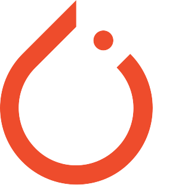

<!-- Thanks to https://github.com/othneildrew/Best-README-Template for the README templates -->
<!-- Improved compatibility of back to top link: See: https://github.com/othneildrew/Best-README-Template/pull/73 -->
<a name="readme-top"></a>


<!-- PROJECT SHIELDS -->
<!--
*** I'm using markdown "reference style" links for readability.
*** Reference links are enclosed in brackets [ ] instead of parentheses ( ).
*** See the bottom of this document for the declaration of the reference variables
*** for contributors-url, forks-url, etc. This is an optional, concise syntax you may use.
*** https://www.markdownguide.org/basic-syntax/#reference-style-links
-->

<!-- PROJECT LOGO -->
<br />
<div align="center">
  <div style="display: flex; justify-content: center; align-items: center;">
    <a href="https://github.com/MrCosta57/food_gan">
        
        
    </a>
  </div>

  <h3 align="center">Food GAN project</h3>

  <p align="center">
    WGAN-GP for conditional food generation!
    <br />
    <a href="https://github.com/MrCosta57/food_gan">View Demo</a>
    ·
    <a href="https://github.com/MrCosta57/food_gan/issues">Report Bug</a>
    ·
    <a href="https://github.com/MrCosta57/food_gan/issues">Request Feature</a>
  </p>
</div>

<div align="center">
<!--Badges space-->

[![LinkedIn][linkedin-shield]][linkedin-url]
</div>
<br/>


<!-- TABLE OF CONTENTS -->
<details style="padding-buttom=10px">
  <summary>Table of Contents</summary>
  <ol>
    <li>
      <a href="#about-the-project">About The Project</a>
      <ul>
        <li><a href="#built-with">Built With</a></li>
      </ul>
    </li>
    <li>
      <a href="#getting-started">Getting Started</a>
      <ul>
        <li><a href="#prerequisites">Prerequisites</a></li>
        <li><a href="#installation">Installation</a></li>
      </ul>
    </li>
    <li><a href="#usage">Usage / Demo</a></li>
    <li><a href="#references">References</a></li>
    <!--
    <li><a href="#roadmap">Roadmap</a></li>
    <li><a href="#contributing">Contributing</a></li>
    <li><a href="#license">License</a></li>
    <li><a href="#contact">Contact</a></li>
    <li><a href="#acknowledgments">Acknowledgments</a></li>
    -->
  </ol>
</details>
<br/>


<!-- ABOUT THE PROJECT -->
## About The Project
![Product Name Screen Shot][product-screenshot]


Here's why:
* Your time should be focused on creating something amazing. A project that solves a problem and helps others
* You shouldn't be doing the same tasks over and over like creating a README from scratch
* You should implement DRY principles to the rest of your life :smile:


<p align="right">(<a href="#readme-top">back to top</a>)</p>


### Built With

This section should list any major frameworks/libraries used to bootstrap your project. Leave any add-ons/plugins for the acknowledgements section. Here are a few examples.

* [![Pytorch][Pytorch]][PyTorch-url]
* [![NumPy][NumPy]][Numpy-url]
* [![Pandas][Pandas]][Pandas-url]
* [![Matplotlib][Matplotlib]][Matplotlib-url]
* [![Fabric][Fabric]][Fabric-url]

<p align="right">(<a href="#readme-top">back to top</a>)</p>


<!-- GETTING STARTED -->
## Getting Started

This is an example of how you may give instructions on setting up your project locally.
To get a local copy up and running follow these simple example steps.

### Prerequisites

This is an example of how to list things you need to use the software and how to install them.

```sh
pip install torch torchvision torchaudio #--index-url https://download.pytorch.org/whl/cu117
pip install lightning
pip install matplotlib
pip install pandas
pip install numpy
pip install streamlit
```

### Installation

1. Clone the repo
   ```sh
   git clone https://github.com/MrCosta57/food_gan.git
   ```
2. Enter your configuration in `config.py`

3. _Before run the streamlit GUI you must place some model checkpoint in `checkpoints/` directory or train the model from scratch_

<p align="right">(<a href="#readme-top">back to top</a>)</p>


<!-- USAGE EXAMPLES -->
## Usage / Demo

You can run one `.ipynb` file or
```sh
streamlit run app.py
```

<p align="right">(<a href="#readme-top">back to top</a>)</p>


## References
    @misc{goodfellow2014generative,
        title={Generative Adversarial Networks}, 
        author={Ian J. Goodfellow and Jean Pouget-Abadie and Mehdi Mirza and Bing Xu and David Warde-Farley and Sherjil Ozair and Aaron Courville and Yoshua Bengio},
        year={2014},
        eprint={1406.2661},
        archivePrefix={arXiv},
        primaryClass={stat.ML}
    }

    @misc{radford2016unsupervised,
        title={Unsupervised Representation Learning with Deep Convolutional Generative Adversarial Networks}, 
        author={Alec Radford and Luke Metz and Soumith Chintala},
        year={2016},
        eprint={1511.06434},
        archivePrefix={arXiv},
        primaryClass={cs.LG}
    }

    @misc{arjovsky2017wasserstein,
        title={Wasserstein GAN}, 
        author={Martin Arjovsky and Soumith Chintala and Léon Bottou},
        year={2017},
        eprint={1701.07875},
        archivePrefix={arXiv},
        primaryClass={stat.ML}
    }

    @misc{gulrajani2017improved,
        title={Improved Training of Wasserstein GANs}, 
        author={Ishaan Gulrajani and Faruk Ahmed and Martin Arjovsky and Vincent Dumoulin and Aaron Courville},
        year={2017},
        eprint={1704.00028},
        archivePrefix={arXiv},
        primaryClass={cs.LG}
    }

<p align="right">(<a href="#readme-top">back to top</a>)</p>

<!-- 
## Roadmap

- [x] Add Changelog
- [x] Add back to top links
- [ ] Add Additional Templates w/ Examples
- [ ] Add "components" document to easily copy & paste sections of the readme
- [ ] Multi-language Support
    - [ ] Chinese
    - [ ] Spanish

See the [open issues](https://github.com/othneildrew/Best-README-Template/issues) for a full list of proposed features (and known issues).

<p align="right">(<a href="#readme-top">back to top</a>)</p>
-->


<!-- CONTRIBUTING -->
<!--## Contributing

Contributions are what make the open source community such an amazing place to learn, inspire, and create. Any contributions you make are **greatly appreciated**.

If you have a suggestion that would make this better, please fork the repo and create a pull request. You can also simply open an issue with the tag "enhancement".
Don't forget to give the project a star! Thanks again!

1. Fork the Project
2. Create your Feature Branch (`git checkout -b feature/AmazingFeature`)
3. Commit your Changes (`git commit -m 'Add some AmazingFeature'`)
4. Push to the Branch (`git push origin feature/AmazingFeature`)
5. Open a Pull Request

<p align="right">(<a href="#readme-top">back to top</a>)</p>
-->


<!-- LICENSE -->
<!--## License

Distributed under the MIT License. See `LICENSE.txt` for more information.

<p align="right">(<a href="#readme-top">back to top</a>)</p>
-->


<!-- CONTACT -->
<!--
## Contact

Your Name - [@your_twitter](https://twitter.com/your_username) - email@example.com

Project Link: [https://github.com/your_username/repo_name](https://github.com/your_username/repo_name)

<p align="right">(<a href="#readme-top">back to top</a>)</p>
-->


<!-- ACKNOWLEDGMENTS -->
<!--## Acknowledgments

Use this space to list resources you find helpful and would like to give credit to. I've included a few of my favorites to kick things off!

* [Choose an Open Source License](https://choosealicense.com)
* [GitHub Emoji Cheat Sheet](https://www.webpagefx.com/tools/emoji-cheat-sheet)
* [Malven's Flexbox Cheatsheet](https://flexbox.malven.co/)
* [Malven's Grid Cheatsheet](https://grid.malven.co/)
* [Img Shields](https://shields.io)
* [GitHub Pages](https://pages.github.com)
* [Font Awesome](https://fontawesome.com)
* [React Icons](https://react-icons.github.io/react-icons/search)

<p align="right">(<a href="#readme-top">back to top</a>)</p>
-->


<!-- MARKDOWN LINKS & IMAGES -->
<!-- https://www.markdownguide.org/basic-syntax/#reference-style-links -->
<!--
[contributors-shield]: https://img.shields.io/github/contributors/othneildrew/Best-README-Template.svg?style=for-the-badge
[contributors-url]: https://github.com/MrCosta57/food_gan/graphs/contributors
[forks-shield]: https://img.shields.io/github/forks/othneildrew/Best-README-Template.svg?style=for-the-badge
[forks-url]: https://github.com/MrCosta57/food_gan/network/members
[stars-shield]: https://img.shields.io/github/stars/othneildrew/Best-README-Template.svg?style=for-the-badge
[stars-url]: https://github.com/MrCosta57/food_gan/stargazers
[issues-shield]: https://img.shields.io/github/issues/othneildrew/Best-README-Template.svg?style=for-the-badge
[issues-url]: https://github.com/MrCosta57/food_gan/issues
-->

[linkedin-shield]: https://img.shields.io/badge/-LinkedIn-black.svg?style=for-the-badge&logo=linkedin&colorB=555
[linkedin-url]: https://www.linkedin.com/in/giovanni-costa-5b0b36238/

[product-screenshot]: images/screenshot.png


[PyTorch]: https://img.shields.io/badge/PyTorch-%23EE4C2C.svg?style=for-the-badge&logo=PyTorch&logoColor=white
[PyTorch-url]: https://pytorch.org/

[Pandas]: https://img.shields.io/badge/pandas-%23150458.svg?style=for-the-badge&logo=pandas&logoColor=white
[Pandas-url]: https://pandas.pydata.org/

[NumPy]: https://img.shields.io/badge/numpy-%23013243.svg?style=for-the-badge&logo=numpy&logoColor=white
[NumPy-url]: https://numpy.org/

[Matplotlib]: https://img.shields.io/badge/Matplotlib-%23ffffff.svg?style=for-the-badge&logo=Matplotlib&logoColor=black
[Matplotlib-url]: https://matplotlib.org/

[Fabric]: https://img.shields.io/badge/-Lightning-792ee5?logo=pytorchlightning&logoColor=white
[Fabric-url]: https://lightning.ai/docs/fabric/stable/