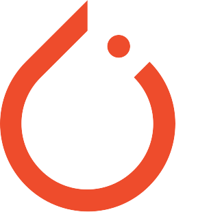
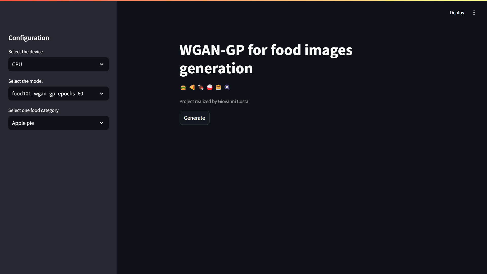

<!-- Thanks to https://github.com/othneildrew/Best-README-Template for the README templates -->
<!-- Improved compatibility of back to top link: See: https://github.com/othneildrew/Best-README-Template/pull/73 -->
<a name="readme-top"></a>


<!-- PROJECT LOGO -->
<br />
<div align="center">
  <div style="display: flex; justify-content: center; align-items: center;">
      
      
  </div>

  <h3 align="center">Food GAN project</h3>

  <p align="center">
    WGAN-GP for conditional food generation!
    <br />
    <a href="https://github.com/MrCosta57/food_gan">View Demo</a>
    ·
    <a href="https://github.com/MrCosta57/food_gan/issues">Report Bug</a>
    ·
    <a href="https://github.com/MrCosta57/food_gan/issues">Request Feature</a>
  </p>
</div>
<br/>


<!-- ABOUT THE PROJECT -->
## About The Project

<div style="text-align:center;">
  
</div>
<br/>

This project refers to the implementation of one personal project for approaching the Generative AI field.
The idea is to gain experience with Generative Adversarial Network models and in particular on Wasserstrein GAN with gradient penalty. This variant allows a more stable training procedure, get rids of some problems like mode collapse and provides a meaningful loss function interpretation. The final application's purpose is to generate synthetic images given a food category.<br/>
In details the NN architectures and the hyperparameters used are taken from different popular parers cited in <a href="#references">References section</a> while instead, the development is realized with Pytorch and Lighting Fabric


<!-- GETTING STARTED -->
## Getting Started

### Deployment

Only CPU inference is supported in the Docker container

1. Build the Docker image
   ```sh
   docker build -t food_gan .
   ```

1. Run the Docker container
   ```sh
   docker run -p 8501:8501 food_gan
   ```

1. Open the browser and go to `http://localhost:8501`


### Development

1. Clone the repo
   ```sh
   git clone https://github.com/MrCosta57/food_gan.git
   ```

1. Run the following commands to install the required libraries
   ```sh
   # CPU
   pip install -r requirements.txt --extra-index-url https://download.pytorch.org/whl/cpu
   # CUDA
   pip install -r requirements.txt --extra-index-url https://download.pytorch.org/whl/cu118
   ```

1. Enter your configuration in `config.py` or use the default one

1. Train the model
   ```sh
   python src/train.py
   ```

1. Run the streamlit GUI
   ```sh
   streamlit run src/app.py
   ```

**Note:** Before run the streamlit GUI you must place some model checkpoint in `checkpoints/` directory or train the model from scratch. You can download one checkpoint from <a href="https://drive.google.com/drive/folders/1MolNVjt3HZZ3bihJG1Cf0_Ij_ChbOE2Q?usp=sharing">Google Drive</a>


## Roadmap / Future work

- [x] Base project structure
- [x] GAN implementation using parameters and convolutional architectures from different papers
- [ ] Train model for more epochs and trying different parameters
- [ ] Trying other discriminator/generator architecture or model


See the [open issues](https://github.com/MrCosta57/food_gan/issues) for a full list of proposed features (and known issues).


## References
    @misc{goodfellow2014generative,
        title={Generative Adversarial Networks}, 
        author={Ian J. Goodfellow and Jean Pouget-Abadie and Mehdi Mirza and Bing Xu and David Warde-Farley and Sherjil Ozair and Aaron Courville and Yoshua Bengio},
        year={2014},
        eprint={1406.2661},
        archivePrefix={arXiv},
        primaryClass={stat.ML}
    }

    @misc{radford2016unsupervised,
        title={Unsupervised Representation Learning with Deep Convolutional Generative Adversarial Networks}, 
        author={Alec Radford and Luke Metz and Soumith Chintala},
        year={2016},
        eprint={1511.06434},
        archivePrefix={arXiv},
        primaryClass={cs.LG}
    }

    @misc{arjovsky2017wasserstein,
        title={Wasserstein GAN}, 
        author={Martin Arjovsky and Soumith Chintala and Léon Bottou},
        year={2017},
        eprint={1701.07875},
        archivePrefix={arXiv},
        primaryClass={stat.ML}
    }

    @misc{gulrajani2017improved,
        title={Improved Training of Wasserstein GANs}, 
        author={Ishaan Gulrajani and Faruk Ahmed and Martin Arjovsky and Vincent Dumoulin and Aaron Courville},
        year={2017},
        eprint={1704.00028},
        archivePrefix={arXiv},
        primaryClass={cs.LG}
    }


<!-- CONTRIBUTING -->
<!--## Contributing

Contributions are what make the open source community such an amazing place to learn, inspire, and create. Any contributions you make are **greatly appreciated**.

If you have a suggestion that would make this better, please fork the repo and create a pull request. You can also simply open an issue with the tag "enhancement".
Don't forget to give the project a star! Thanks again!

1. Fork the Project
2. Create your Feature Branch (`git checkout -b feature/AmazingFeature`)
3. Commit your Changes (`git commit -m 'Add some AmazingFeature'`)
4. Push to the Branch (`git push origin feature/AmazingFeature`)
5. Open a Pull Request


-->


<!-- LICENSE -->
<!--## License

Distributed under the MIT License. See `LICENSE.txt` for more information.


-->


<!-- CONTACT -->
<!--
## Contact

Your Name - [@your_twitter](https://twitter.com/your_username) - email@example.com

Project Link: [https://github.com/your_username/repo_name](https://github.com/your_username/repo_name)


-->


<!-- ACKNOWLEDGMENTS -->
<!--## Acknowledgments

Use this space to list resources you find helpful and would like to give credit to. I've included a few of my favorites to kick things off!

* [Choose an Open Source License](https://choosealicense.com)
* [GitHub Emoji Cheat Sheet](https://www.webpagefx.com/tools/emoji-cheat-sheet)
* [Malven's Flexbox Cheatsheet](https://flexbox.malven.co/)
* [Malven's Grid Cheatsheet](https://grid.malven.co/)
* [Img Shields](https://shields.io)
* [GitHub Pages](https://pages.github.com)
* [Font Awesome](https://fontawesome.com)
* [React Icons](https://react-icons.github.io/react-icons/search)


-->


<!-- MARKDOWN LINKS & IMAGES -->
<!-- https://www.markdownguide.org/basic-syntax/#reference-style-links -->
<!--
[contributors-shield]: https://img.shields.io/github/contributors/othneildrew/Best-README-Template.svg?style=for-the-badge
[contributors-url]: https://github.com/MrCosta57/food_gan/graphs/contributors
[forks-shield]: https://img.shields.io/github/forks/othneildrew/Best-README-Template.svg?style=for-the-badge
[forks-url]: https://github.com/MrCosta57/food_gan/network/members
[stars-shield]: https://img.shields.io/github/stars/othneildrew/Best-README-Template.svg?style=for-the-badge
[stars-url]: https://github.com/MrCosta57/food_gan/stargazers
[issues-shield]: https://img.shields.io/github/issues/othneildrew/Best-README-Template.svg?style=for-the-badge
[issues-url]: https://github.com/MrCosta57/food_gan/issues
-->

[linkedin-shield]: https://img.shields.io/badge/-LinkedIn-black.svg?style=for-the-badge&logo=linkedin&colorB=555
[linkedin-url]: https://www.linkedin.com/in/giovanni-costa-5b0b36238/

[PyTorch]: https://img.shields.io/badge/PyTorch-%23EE4C2C.svg?style=for-the-badge&logo=PyTorch&logoColor=white
[PyTorch-url]: https://pytorch.org/

[Pandas]: https://img.shields.io/badge/pandas-%23150458.svg?style=for-the-badge&logo=pandas&logoColor=white
[Pandas-url]: https://pandas.pydata.org/

[NumPy]: https://img.shields.io/badge/numpy-%23013243.svg?style=for-the-badge&logo=numpy&logoColor=white
[NumPy-url]: https://numpy.org/

[Matplotlib]: https://img.shields.io/badge/Matplotlib-%23ffffff.svg?style=for-the-badge&logo=Matplotlib&logoColor=black
[Matplotlib-url]: https://matplotlib.org/

[Fabric]: https://img.shields.io/badge/-Lightning-792ee5?logo=pytorchlightning&logoColor=white
[Fabric-url]: https://lightning.ai/docs/fabric/stable/